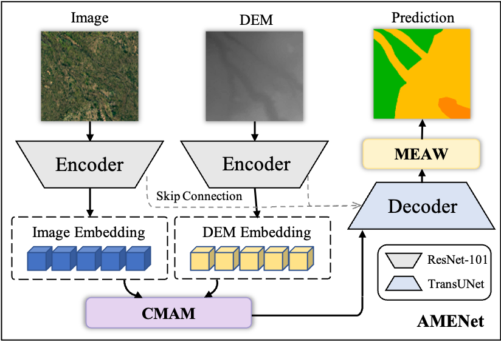

# AMENet and CBLS-RGB-DEM dataset

## AMENet

## CBLS-RGB-DEM dataset
You can use **CBLS-RGB-DEM dataset** in the **https://github.com/HanXinfun/CBLS-RGB-DEM**,

### How to train
You can use **python train.py** to train the model. Our AMENet is in the **model folder**, and the related comparison model is in the **compare_model folder**.
